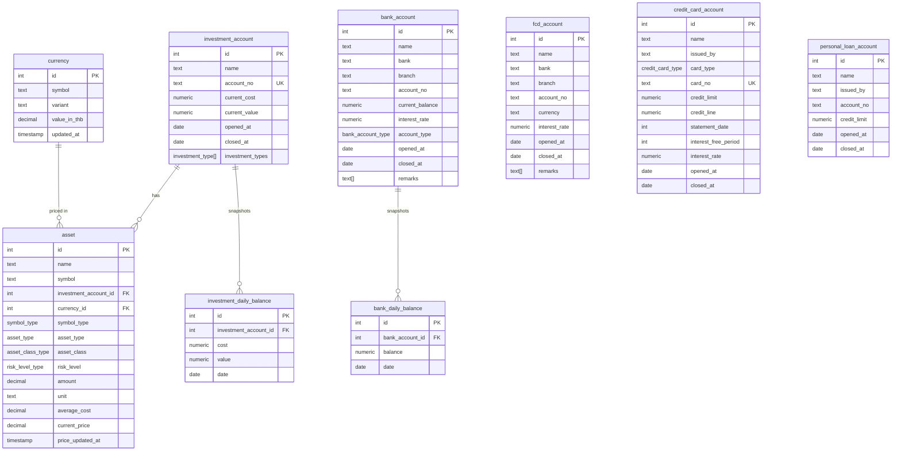

# @repo/database

Drizzle ORM schema and Postgres client for the portfolio tracking system.

The database stores the **current state** of bank accounts, investment accounts,
their underlying assets, FX rates, and credit/loan accounts. It also stores a
**daily history** of bank balances and investment account values so day-over-day
performance can be computed.

The only writer today is [`apps/cron`](../../apps/cron/) which runs once per day to
refresh prices, recalculate balances, and append a new daily snapshot.

## Layout

- [src/schema/](src/schema/) — table definitions, exported per-file and re-exported via [src/schema/index.ts](src/schema/index.ts)
- [src/client.ts](src/client.ts) — `db` (drizzle instance) and `pgClient` (raw `postgres-js` client). Consumers import from `@repo/database/client` and `@repo/database/schema`.
- [drizzle/](drizzle/) — generated migrations (drizzle-kit). `meta/` holds per-migration snapshots used by the kit.
- [drizzle.config.ts](drizzle.config.ts) — drizzle-kit config; reads `DATABASE_URL` from `.env`.

## Scripts

```
pnpm db:generate   # generate a new migration from schema changes
pnpm db:migrate    # apply pending migrations
pnpm db:export     # export the schema (drizzle-kit export)
```

## Entity-relationship overview



There are two disconnected subgraphs:

- **Investment side** — `investment_account` → `asset` → `currency`, with `investment_daily_balance` as the time series.
- **Bank side** — `bank_account` → `bank_daily_balance` as the time series. `fcd_account` is a separate, currently un-snapshotted multi-currency account.

`credit_card_account` and `personal_loan_account` are independent records (no foreign keys, no daily snapshot).

## Tables

### Investment domain

#### `investment_account` — [investmentAccount.ts](src/schema/investmentAccount.ts)
A brokerage-like container that holds many `asset` rows.

| Column | Notes |
| --- | --- |
| `id` | identity PK |
| `name` | display name |
| `account_no` | unique account number |
| `current_cost` | sum of cost basis across held assets, in THB. Maintained manually / by user data entry. |
| `current_value` | total mark-to-market value in THB. **Recomputed daily by the cron** from each asset's `amount * current_price * currency.value_in_thb`. |
| `opened_at` / `closed_at` | account lifecycle dates |
| `investment_types` | array of `investment_type` enum values describing what kinds of holdings live here |

#### `asset` — [assets.ts](src/schema/assets.ts)
A single position inside an investment account.

| Column | Notes |
| --- | --- |
| `id` | identity PK |
| `name` | human-readable name |
| `symbol` | ticker / fund code; nullable for assets that don't have one (e.g. physical gold) |
| `investment_account_id` | FK → `investment_account.id` (NOT NULL) |
| `currency_id` | FK → `currency.id` — currency that `current_price` and `average_cost` are denominated in |
| `symbol_type` | `thai_stock`, `thai_mutual_fund`, `offshore_stock`, `cryptocurrency`. Used by the price-update step to pick the right scraper. |
| `asset_type` | fine-grained category (e.g. `thai_stock`, `us_stock_drx`, `gold`, `digital_asset`) |
| `asset_class` | broader bucket: `cash`, `bond`, `stock`, `gold`, `digital_asset` |
| `risk_level` | `safe_core` … `higher_satellite` |
| `amount` | quantity held (default `0`) |
| `unit` | unit string for `amount` (e.g. `"shares"`, `"baht-weight"`) |
| `average_cost` | per-unit cost basis in this asset's currency |
| `current_price` | last fetched market price in this asset's currency |
| `price_updated_at` | timestamp; auto-bumped on update via Drizzle `$onUpdate`. May be null for legacy rows. |

The price-update step in `apps/cron` filters by `amount > 0` so untraded/empty positions are skipped.

#### `currency` — [currency.ts](src/schema/currency.ts)
FX table: maps a currency (and optional `variant`) to its current THB value.

| Column | Notes |
| --- | --- |
| `id` | identity PK |
| `symbol` | currency code, e.g. `USD`, `THB` |
| `variant` | optional discriminator (e.g. different rate sources / variants of the same symbol). Unique together with `symbol`, with `nullsNotDistinct` so `(USD, NULL)` collides with `(USD, NULL)`. |
| `value_in_thb` | how many THB equal one unit of this currency |
| `updated_at` | auto-bumped on update |

`THB` is the "1.0 to itself" base. The cron sets `USD.value_in_thb` from the Binance `USDTTHB` price as an estimation.

#### `investment_daily_balance` — [investmentAccount.ts](src/schema/investmentAccount.ts)
Per-day snapshot of `(cost, value)` per investment account.

- FK `investment_account_id` → `investment_account.id`, **`onDelete: cascade`**.
- Unique `(investment_account_id, date)` so a given account has at most one row per day.
- Written by `dailyBalance()` with `onConflictDoNothing()`, so re-running the cron is idempotent.
- Backfilled by `fillMissingData()`: if there's a gap between two dates for the same account, the previous row's values are forward-filled into the missing days.

### Bank domain

#### `bank_account` — [bankAccount.ts](src/schema/bankAccount.ts)
A single THB bank account.

| Column | Notes |
| --- | --- |
| `id` | identity PK |
| `name`, `bank`, `branch`, `account_no` | identifying fields. Unique on `(bank, account_no)`. |
| `current_balance` | latest known balance in THB (manually maintained) |
| `interest_rate` | informational |
| `account_type` | `savings`, `e_savings`, `fixed` |
| `opened_at` / `closed_at` | lifecycle |
| `remarks` | free-form `text[]` |

#### `fcd_account` — [bankAccount.ts](src/schema/bankAccount.ts)
Foreign Currency Deposit account. Same shape as `bank_account` but parameterised by `currency` (text). **Not currently captured in `bank_daily_balance`** — it is an independent record.

#### `bank_daily_balance` — [bankAccount.ts](src/schema/bankAccount.ts)
Per-day snapshot of `current_balance` per bank account.

- FK `bank_account_id` → `bank_account.id`, **`onDelete: cascade`**.
- Unique `(bank_account_id, date)`.
- The cron only snapshots accounts where `closed_at IS NULL OR closed_at >= dateStr`. Closed accounts are excluded going forward, but historical rows are preserved (cascade applies only on hard deletes).
- Same idempotent insert + gap-fill behavior as `investment_daily_balance`.

### Credit / loan domain

#### `credit_card_account` — [loanAccount.ts](src/schema/loanAccount.ts)
Credit card record. `credit_limit` is the assigned limit; `credit_line` is the currently usable line. `card_no` is unique. No FK and no time series.

#### `personal_loan_account` — [loanAccount.ts](src/schema/loanAccount.ts)
Personal loan / revolving line. Unique `(issued_by, account_no)` (account_no is nullable). No FK and no time series.

These two tables exist for record-keeping; they aren't read or written by the cron.

## Enums — [types.ts](src/schema/types.ts) and others

Enum types defined in Postgres via `pgEnum`:

| Enum | Values | Used by |
| --- | --- | --- |
| `investment_type` | `mutual_fund`, `thai_stock`, `offshore_stock_dr`, `us_stock`, `us_stock_drx`, `gold`, `government_bond`, `coperate_bond`, `digital_asset` | `investment_account.investment_types[]` |
| `symbol_type` | `thai_stock`, `thai_mutual_fund`, `offshore_stock`, `cryptocurrency` | `asset.symbol_type` (drives which scraper handles the symbol) |
| `asset_type` | `thai_cash`, `thai_fixed_cash`, `foreign_cash`, `thai_stock`, `offshore_stock`, `gold`, `thai_government_bond`, `thai_coperate_bond`, `foreign_government_bond`, `foreign_coperate_bond`, `digital_asset` | `asset.asset_type` |
| `asset_class_type` | `cash`, `bond`, `stock`, `gold`, `digital_asset` | `asset.asset_class` |
| `risk_level_type` | `safe_core`, `surface_core`, `lower_satellite`, `mid_satellite`, `higher_satellite` | `asset.risk_level` (core-satellite portfolio bucketing) |
| `bank_account_type` | `savings`, `e_savings`, `fixed` | `bank_account.account_type` |
| `credit_card_type` | `visa`, `mastercard`, `american_express`, `jcb`, `unionpay` | `credit_card_account.card_type` |

Note: `coperate_bond` is a typo of `corporate_bond` preserved across the schema for backward compatibility.

## How the cron writes this database

[`apps/cron`](../../apps/cron/) runs four steps in order ([apps/cron/src/index.ts](../../apps/cron/src/index.ts)):

1. **`priceUpdateStep`** ([priceUpdate/index.ts](../../apps/cron/src/functions/priceUpdate/index.ts))
   Reads `asset` rows with `amount > 0`, groups by `symbol_type`, fetches prices from
   Yahoo Finance / SEC Fund API / Binance.th / CoinGecko, and writes back
   `asset.current_price` (which auto-updates `price_updated_at`). It also
   updates `currency.value_in_thb` for `USD` from the Binance `USDTTHB` price.

2. **`calculateBalance`** ([calculateBalance/index.ts](../../apps/cron/src/functions/calculateBalance/index.ts))
   For each `investment_account` with `current_cost > 0`, joins its `asset` rows
   to `currency`, computes `Σ amount * current_price * value_in_thb`, and writes
   the result into `investment_account.current_value`. Also reports any asset
   with `price_updated_at` older than 24h, or any non-THB currency with
   `updated_at` older than 24h, as stale.

3. **`dailyBalance`** ([daily/dailyBalance.ts](../../apps/cron/src/functions/daily/dailyBalance.ts))
   For yesterday's date, inserts one row per active `bank_account` into
   `bank_daily_balance` (snapshotting `current_balance`) and one row per
   `investment_account` into `investment_daily_balance` (snapshotting
   `current_cost` and `current_value`). Both inserts use
   `onConflictDoNothing()` against the `(account_id, date)` unique index, so
   re-running the cron is safe.

4. **`fillMissingData`** ([daily/fillMissingData.ts](../../apps/cron/src/functions/daily/fillMissingData.ts))
   Scans each daily balance table per account, sorts by date, and forward-fills
   any missing day with the previous day's values. Used to recover from days
   when the cron didn't run.

After those steps, [summary.ts](../../apps/cron/src/summary.ts) computes
day-over-day deltas using yesterday's snapshot (or, if missing, the latest date
that exists in **both** daily balance tables) and posts a Discord summary.

## Conventions and gotchas

- **THB is the reporting currency.** `current_value`, `current_balance`, and the daily-balance tables are all in THB. Per-asset `current_price` and `average_cost` are in the asset's own currency, then converted via `currency.value_in_thb` at calculation time.
- **`numeric` / `decimal` columns are returned as strings** by `postgres-js` to avoid float precision loss. Application code does `parseFloat` / `String(...)` at the boundaries — see `calculateBalance` and `priceUpdateStep` for examples.
- **`current_cost` is user-maintained.** The cron does not update it. Only `current_value` is recomputed.
- **Idempotency.** All daily inserts rely on the `(account_id, date)` unique constraint plus `onConflictDoNothing()`. Re-running the cron on the same day is safe; it will not duplicate rows but it will overwrite `asset.current_price` / `investment_account.current_value` with fresh numbers.
- **`price_updated_at` is nullable** (migration `0012`). Treat null as "never updated" — the staleness check in `calculateBalance` only flags rows where the timestamp is non-null and older than 24h.
- **Cascade deletes.** Deleting an `investment_account` or `bank_account` removes its daily balance history. There is no soft-delete; closed accounts are kept with `closed_at` set.
- **`fcd_account` has no time series.** If FCD balance history becomes important, it needs its own `*_daily_balance` table.
